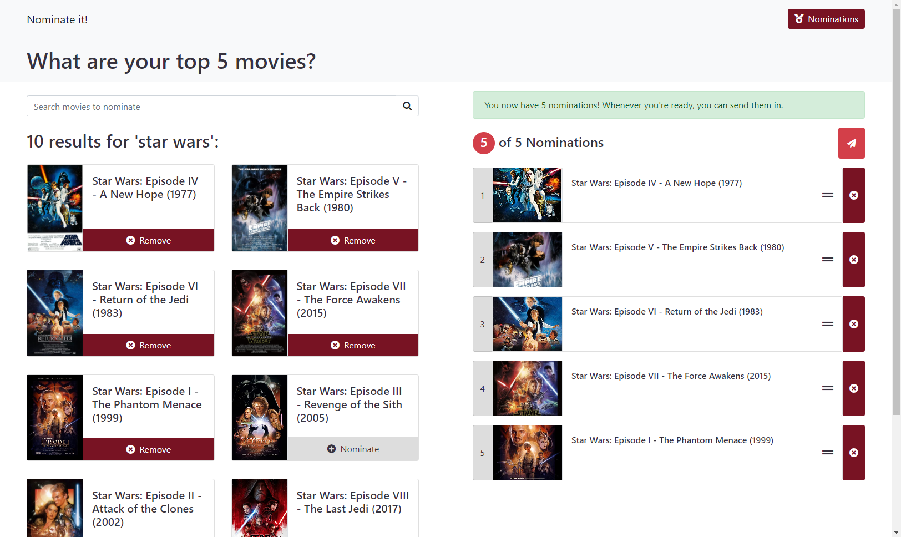

# Nominate it!

:pushpin: This project is currently under development!

:link: [Visit Nominate It](nominate-it.herokuapp.com/)

Nominate is a website for sending in your top 5 movies.

Add movies to your nomination list by selecting a result from the search. Your submission will appear on the 'Nominees' page. Browse through the lists to see what other people nominated as their top 5's.

All movie data is retrieved with the [OMDb API](http://www.omdbapi.com/).

## Built with

### Front-End

- [React](https://reactjs.org/)
- [Bootstrap](https://getbootstrap.com/)
- [FontAwesome](https://fontawesome.com/)

### Back-End

- [Express](https://expressjs.com/)
- [Mongoose](https://mongoosejs.com/)
- [Axios](https://www.npmjs.com/package/axios)

## License

This project is licensed under the **MIT License**.

This project was bootstrapped with [Create React App](https://github.com/facebook/create-react-app).
